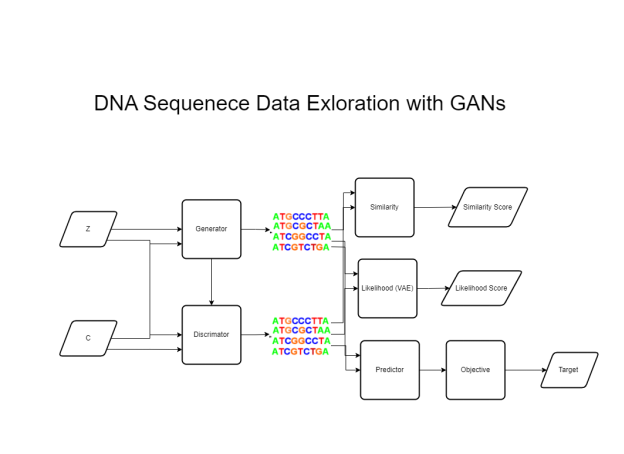

# Deep-Exploration-in-DNA-Sequence-Generation-Advancing-Bioinformatics-with-Generative-Neural-Networks-DCGAN
## Overview
BioSeqGen is a groundbreaking technology developed under the "Deep Exploration in Sequence Generation" project. It leverages Deep Exploration Networks (DENs) to generate DNA, RNA, and protein sequences with unparalleled diversity and biological relevance. The technology operates at the intersection of advanced machine learning, bioinformatics, and synthetic biology, offering a novel solution for drug discovery, genetic research, and biomaterials development.
The DEN framework within BioSeqGen maximizes sequence diversity through activation-maximizing neural networks and implements a similarity penalty to ensure the uniqueness of each sequence. Incorporating DCGAN, BioSeqGen estimates sequence likelihood with high confidence, predictive model to identify target, making it a powerful tool for researchers and industry professionals alike.
From a business perspective, BioSeqGen presents a significant opportunity for pharmaceutical companies and biotech startups by accelerating the drug discovery process and reducing the time and cost associated with lab experiments. The socio-economic impact of this technology is profound, with the potential to fast-track the development of life-saving medications and sustainable biomaterials.
Key highlights of BioSeqGen include its high efficiency, accuracy in sequence generation, and adaptability to various biological and computational research needs. Future revenue projections are promising, with the potential to capture a substantial market share in the biotechnology and pharmaceutical industries through licensing agreements, partnerships, and direct sales to research institutions.

## Process

